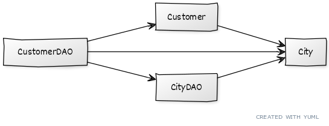

# Python Data Access - DTO
This project implements the [DAO pattern](http://www.corej2eepatterns.com/DataAccessObject.htm) as a way to practice data access with Python. It uses the _MySQL Connector_ [MySQL driver](https://www.w3schools.com/python/python_mysql_getstarted.asp) for basic MySQL data access.

This branch solves an issue pointed out in the main branch: **the lack of a consistent [data transfer object](http://www.corej2eepatterns.com/TransferObject.htm) (DTO) to enable data in and out of DAOs**.

If you want to understand this project, please check the [`main` branch](https://github.com/gabrielcostasilva/python-data-access) first.

## The Problem
The original [DAO pattern](http://www.corej2eepatterns.com/DataAccessObject.htm) describes a [DTO](http://www.corej2eepatterns.com/TransferObject.htm) to transfering data between objects. A DTO is a simple object that groups data, i.e. attributes. It turns out that the project in the `main` branch does not use DTOs - at least, not as expected.

Python uses dictionaries (`dict`) data type for representing key-value data structures. In Java and JS, we tend to use objects to represent the same kind of structure that are represented by `dict` in Python.

The original project in the `main` branch used `dict` and `tuples` for representing data. `tuples` are the default data type returned by the _MySQL Connector_ driver. The problem of using `dict` or `tuples` for transporting data is that they do not allow a strict definition of data at compile time. 

See the example using `dict`:
```
dao.create({"city_name": "Londrina"})
```

Now, see the same example using an object:

```
dao.create(City(1, "Londrina"))
```
An object forces setting required attributes, otherwise it raises errors. For example: 
```
dao.create(City(1, "Londrina", "PR"))
```
This last code snippet would raise: `TypeError: __init__() takes 3 positional arguments but 4 were given`. In addition, by using an object you benefit from methods that validate entries, format printing, enable comparison and sorting, for instance.

## The Solution
I found at least three possible solutions to implementing a DTO in Python. The first is using a simple class, of course. The second uses third-party libraries, such as [Pydantic](https://pydantic-docs.helpmanual.io) or [attr](https://www.attrs.org/en/stable/). But, the third solution seems to be to right way to go: [dataclasses](https://www.youtube.com/watch?v=vRVVyl9uaZc).

A `dataclass` is similar to a Java `record`. Therefore, all you have to do is to set the attributes and all the boilerplate is automatically done for you. See the example of the `City dataclass` below.

```
from dataclasses import dataclass

@dataclass
class City:
    id: int
    name: str
```

The change in the `DAO` classes was minimal, as you can check by examining the commit in this branch.

## The Cost
This solution comes to a cost though: as any reuse strategy, it inherits [benefits and drawbacks](https://www.slideshare.net/software-engineering-book/ch15-software-reuse). We highlight two drawbacks that you should be aware of, although they worth it. First, our code grew due to the addition of `dataclass`es. As we have two entities (represented by two tables), we need two new classes. 

Next, coupling also increased, as the Figure below shows. Now, `CustomerDAO` uses both `Customer` and `City`, as a `Customer` carries a `City`. `Customer` and `City` dataclasses are also coupled.



## Warning
For some reason, the `dataclasses` module was unavailable in my system. So, I had to install it with `pip`.