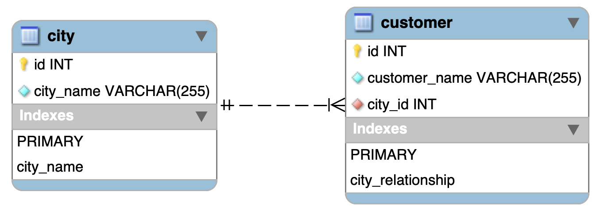
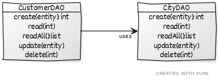

# Python Data Access
This project implements the [DAO pattern](http://www.corej2eepatterns.com/DataAccessObject.htm) as a way to practice data access with Python. It uses the _MySQL Connector_ [MySQL driver](https://www.w3schools.com/python/python_mysql_getstarted.asp) for basic MySQL data access.

This branch features a basic implementation full of issues, which I plan to address in other branches.

## Project Overview

There are two tables, `city` and `customer`. Each table has an `id` as its unique identifiers. `id`s are _auto incremented_. In addition, each table has a `name` field that identifies the item name. `name` fields have a constraint that impedes name length less than 2 characters long. In addition, `name`s cannot be `null`. The `city_name` must be unique. One can check script details in `./db-scripts`.

There is a _one-to-many_ relationship between `city` and `customer`. This relationship impedes deleting a `city` used by a `customer`. This relationship also implies that a `customer` carries a `city`.

## The DAO Pattern
The DAO pattern decouples the application and the data store, increasing the application portability. 

Each persistent entity (tables, in our example) should have a respective DAO class with tradicional CRUD methods: Create, Read (single and all), Update and Delete. 

The Figure above represents the relationship we have in our code. Each DAO groups possible CRUD operations for `customer` and `city` as follows:

* `CityDAO` enables creating, reading, updating and deleting cities in a database. Each method implements MySQL Connector functions for accessing a MySQL database;

* `CustomerDAO` is similar to `CityDAO`, it enables creating, reading, updating and deleting customers in a database. However, a `customer` has a relationship with `city` as a _customer lives in a city_. Therefore, each `customer` retrieved from the database also carries a key (`city_id`) to a `city`. Retrieving a `customer` requires retrieving the appropriate `city` by using the `CityDAO`, which sets the relationship between the two classes.

## Issues
Although this project is a valid implementation of DAO pattern, this branch has several issues:

* ~~It lacks a consistent [data transfer object](http://www.corej2eepatterns.com/TransferObject.htm) (DTO) to enable data in and out of DAOs;~~ - checkout branch [dto](https://github.com/gabrielcostasilva/python-data-access/tree/dto)
* ~~It lacks unit tests;~~ - check out branch [unit-test](https://github.com/gabrielcostasilva/python-data-access/tree/unit-test)
* It opens a new connection each time a DAO is instantiated;
* It repeats itself a lot!
* It requires setting the entire environment by hand - no automation!
* The project is tied to MySQL database;
* DAO methods does not return objects;
* Data types are not enforced;
* Dataclasses are not immutable;
* It lacks logging;
* UI and internal concerns are tangled;
* Mocks or testcontainers could improve tests.

**Notice that** these issues and their resolution in other branches in this repository follow the order in which they are presented in the list above.

## Project Setup

You need Python 3 and the MySQL Connector driver. You also need MySQL installed (or a docker container with MySQL). Run scripts in `./db-scripts` folder to set up the basic schema. Finally, run the code to checkout the DAO working.
