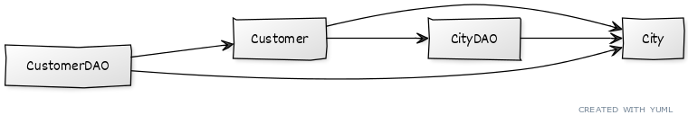

# Python Data Access - DAO Classes Populate Data Rather Than DTOs
This project implements the [DAO pattern](http://www.corej2eepatterns.com/DataAccessObject.htm) as a way to practice data access with Python. It uses the _MySQL Connector_ [MySQL driver](https://www.w3schools.com/python/python_mysql_getstarted.asp) for basic MySQL data access.

This branch solves an issue pointed out in the `main` branch: **DAO classes are responsible for populating dataclasses data**.

If you want to understand this project, please check the [`main` branch](https://github.com/gabrielcostasilva/python-data-access) first.

## The Problem
DTOs are often used to transfer data between layers in a [layered architecture](). 

For instance, consider the _persistence layer_ that retrieves data from a database. The data is retrieved in an object, usually, an _entity_. One should not send the _entity_ to the upper layer (e.g., service layer). Although doing so may ease the development, it may damage the persistent object. 

In addition, each layer may work with different objects. For example, the UI layer may map UI components into a single object, but this single object may be broken down into three persistent objects in the persistence layer.

Therefore, a DTO should create an instance of itself based on values from other objects with which the DTO interacts. This places the responsibility of knowing objects into one single object - the DTO.

In the previous _branch_, the data referred from a `cursor` was sent to the DAO class to be transferred to the DTO, like so:

```
class CityDAO(AbstractDAO):

    def fetch_single_entity(self, cursor):
        city_id, city_name = cursor.fetchone()
        return City(city_name, city_id)

```

The DTO should build itself from a `cursor` rather than the DAO.

## The Solution
DAO methods `fetch_single_entity(cursor)` and `fetch_many_entities(cursor)` were replaced with DTO `static` factory methods `value_of` (single entity) and `of` (multiple entities), as follows:   

```
    @staticmethod
    def value_of(cursor):
        # Retrieve data from cursor and return a single object

    @staticmethod
    def of(cursor):
        # Retrieve data from cursor and return a list of objects
```

Another major change took place in the `AbstractDAO`. Read methods now call the current entity and then use the factory method to instantiate the object, like so:

```
    def read(self, id: int):
        mycursor = self.connection.cursor()
        mycursor.execute(f"SELECT * FROM {self.get_main_table_name()} WHERE id = %s", (id,))
        return self.get_entity().value_of(mycursor)
```

The abstract method `get_entity()` returns the current entity and must be implemented by all `AbstractDAO` subclasses.

```
class CityDAO(AbstractDAO):

    def get_entity(self):
        return City()
```

## The Cost
We increased a few LoC with this change. However, the major cost is violating the one-direction layered architecture rule. By moving the previous code from the DAO to the DTO (or entity, because we are in the persistence layer) we made `Customer` entity to depend on `CityDAO`.

<figure>
    
    <label>Relationship <em>before</em> the change in this branch.</label>
</figure>

<figure>
    
    <label>Relationship <em>after</em> the change in this branch.</label>
</figure>

The relevance of this cost depends on the packaging strategy used in the application.

## Warning
To enable creating the implementation of the `get_entity()` method, we had to give a default value to `City` and `Customer` attributes. We did not use `field` as its benefit is not entirely clear to me yet.